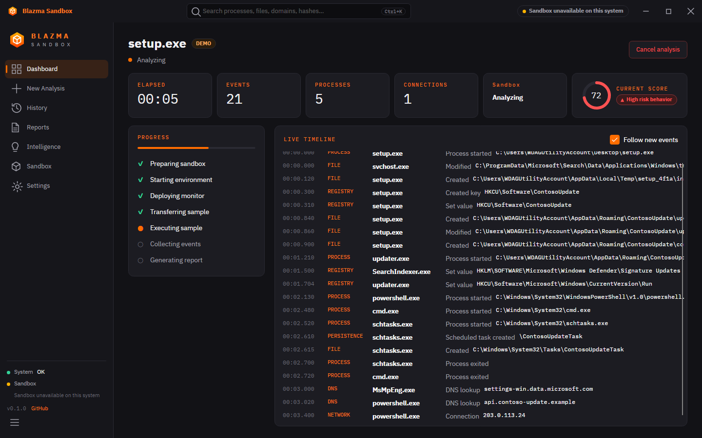
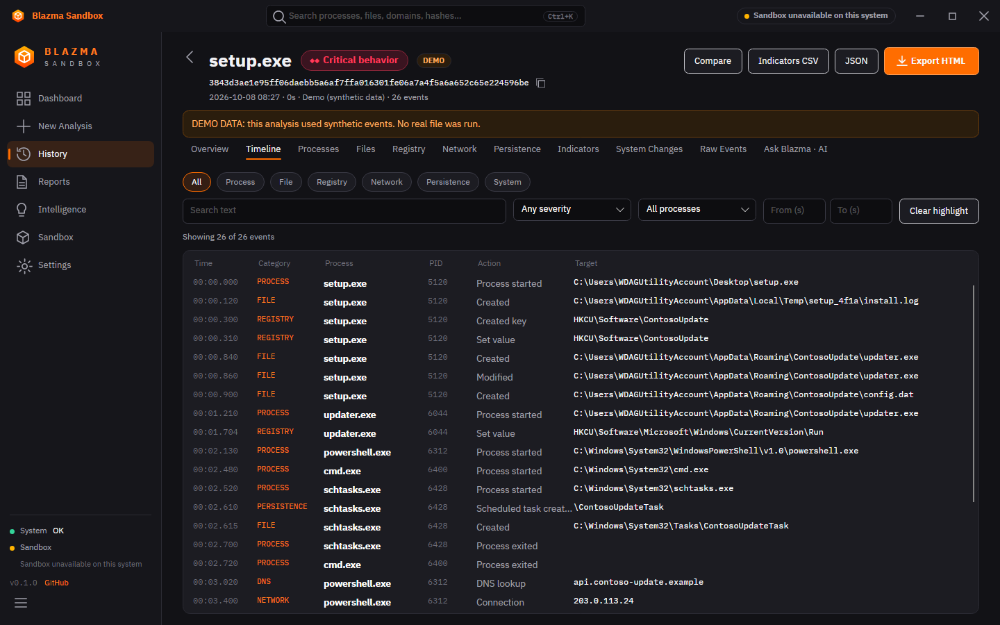
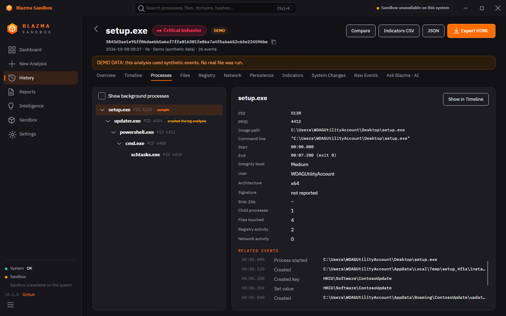
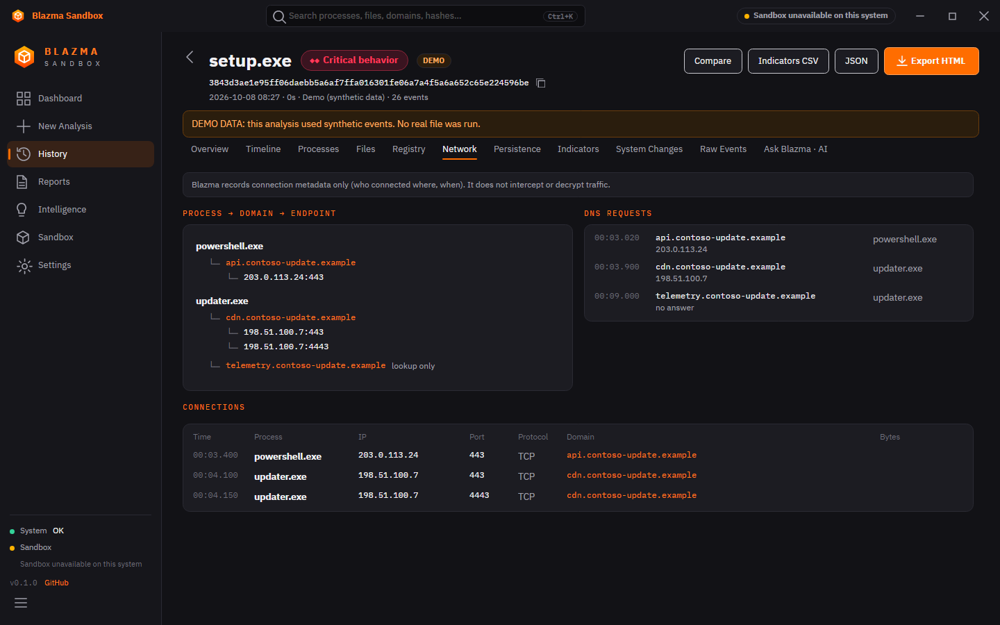
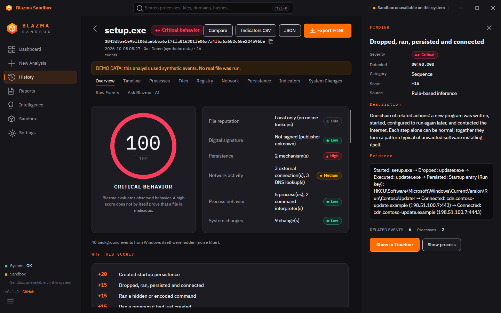
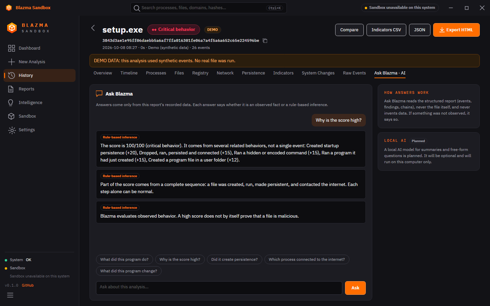
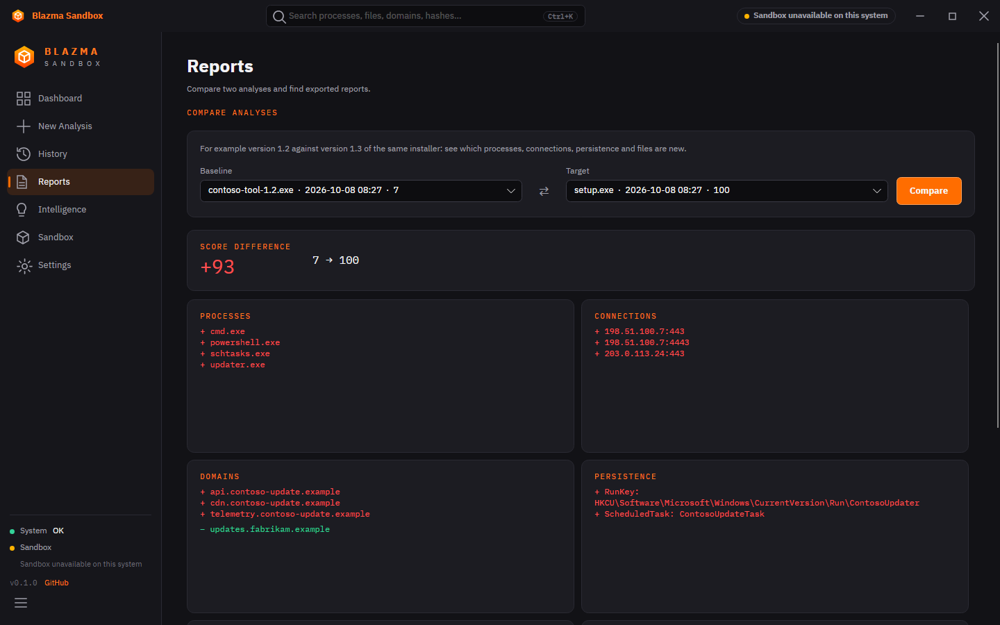
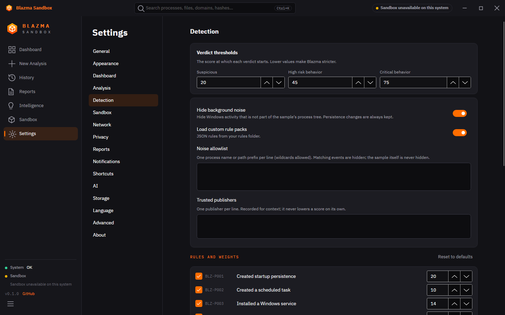
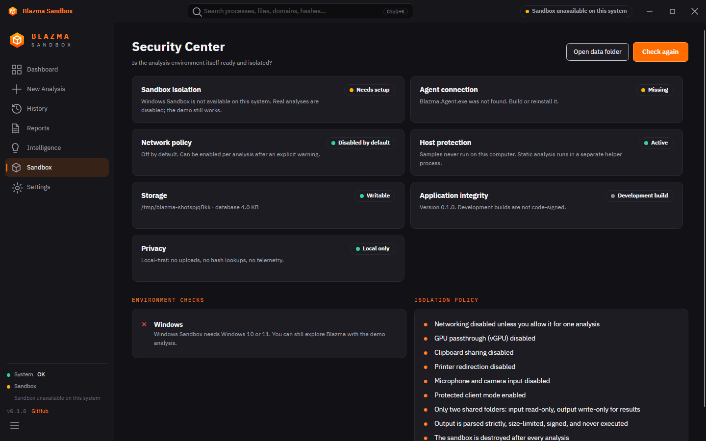

<p align="center">
  
</p>

<h1 align="center">Blazma Sandbox</h1>
<p align="center"><b>Analyze. Observe. Understand.</b></p>
<p align="center">Part of the Blazma family · Windows · English / العربية</p>

<p align="center">
  
</p>

Blazma Sandbox analyzes suspicious files and programs on Windows. It inspects a file
without running it, runs it inside an isolated, disposable **Windows Sandbox**, watches
what it does, links the events together, and turns them into a report anyone can read:

- **What happened?** A timeline, a process tree and behavior chains.
- **Why does it matter?** Plain-language explanations and an explainable risk score.
- **What evidence supports this?** Every finding links back to the events it is based on.

Blazma is **not an antivirus**. It never calls a file "malware" from one indicator. The
score describes observed behavior; *a high score does not by itself prove that a file is
malicious*.

> Blazma Sandbox is intended for defensive analysis and **authorized** security research.

## Features

| Area | What you get |
|---|---|
| **Static analysis** | SHA-256/SHA-1, file type, PE headers, sections and entropy, imports/exports, resources, version info, offline Authenticode check, a limited set of meaningful strings. Runs in a separate helper process and never executes the file. |
| **Isolated execution** | Windows Sandbox with every optional channel off (no network, no clipboard, no GPU, no printer, no mic/camera), two mapped folders only, destroyed after each run. |
| **Monitoring** | In-sandbox agent using ETW: processes, files, registry, TCP/UDP connections, DNS, scheduled tasks, plus before/after snapshots. |
| **Unified timeline** | One event model for everything, ordered and filterable by category, severity, process, time range and text. Virtualised for 100k+ events. |
| **Correlation** | PID-reuse-safe process tree, "dropped then executed" detection, behavior chains such as *setup.exe → created updater.exe → ran it → startup entry → contacted endpoint*. |
| **Persistence detection** | Run keys, Startup folder, scheduled tasks, services, Winlogon, IFEO, AppInit, Active Setup, each with a human explanation and the technical details. |
| **Risk engine** | 24 contextual rules with ATT&CK IDs, per-category caps, a "Why this score?" breakdown, sequence rules that weigh combinations, and noise suppression for Windows background activity. |
| **Indicators** | Hashes, domains, IPs, paths, registry locations, process names. Graded only by evidence: Informational, Observed, Suspicious, High risk, Watchlist match. |
| **Reports** | Self-contained HTML (no scripts, CSP-locked) and machine-readable JSON with a content integrity hash; indicator CSV. Personal details are redacted by default. |
| **Ask Blazma** | Ask questions about a report ("Why is the score high?", "ليش أعطيت الملف High Risk؟"). Answers come only from the data and are labelled *observed fact* or *rule-based inference*. |
| **Compare analyses** | Version 1.2 vs 1.3 of the same installer: new processes, connections, domains, persistence, dropped files, score difference. |
| **Customisation** | Themes (Dark, Midnight, Light), accent colour (Blazma family shades), density, UI scale, reduced motion, dashboard cards, analysis profiles, verdict thresholds, per-rule enable/weight, your own JSON rule packs, a local watchlist, noise allowlist, editable shortcuts, report contents, retention. |
| **Bilingual** | Full English and Arabic with real right-to-left layout. Technical terms (SHA-256, PID, IP, Registry) stay recognisable. |
| **Local first** | No uploads, no hash lookups, no telemetry. Everything stays in one folder on your computer. |

## Screenshots

| | |
|---|---|
|  |  |
|  |  |
|  |  |
|  |  |
|  |  |
|  |  |

All screenshots use the built-in **demo analysis**: synthetic events, clearly labelled DEMO,
processed by the real engine. No sample was run to make them.

## Architecture

```
Blazma.App (Avalonia UI) ──► Blazma.Analysis ──► Blazma.Core ◄── Blazma.Storage (SQLite)
        │                       (static, rules,       ▲          Blazma.Reporting (HTML/JSON)
        │                        correlation, risk)    │          Blazma.Intelligence (Ask Blazma)
        └──► Blazma.Sandbox ── Windows Sandbox provider · file channel · demo provider
                  │  ▲
     in/ (read-only)│  │ out/ (writable, untrusted, HMAC-signed)
                  ▼  │
             Blazma.Agent  (runs ONLY inside the sandbox, shares only Blazma.Contracts)
```

See **[docs/ARCHITECTURE.md](docs/ARCHITECTURE.md)** for the boundaries, the analysis state
machine, the data model and the design decisions, and **[SECURITY.md](SECURITY.md)** for the
security model and its limits.

## Requirements

- **To analyze real files:** Windows 10 (1903+) or Windows 11, **Pro, Enterprise or Education**,
  with virtualization enabled in firmware and the *Windows Sandbox* optional feature turned on
  (`optionalfeatures.exe`). Windows Home does not include Windows Sandbox.
- **To build:** .NET 10 SDK. Builds on Windows, Linux and macOS; the demo analysis and all tests
  run everywhere.

## Build from source

```bash
git clone https://github.com/mr-kateba/Blazma-Sandbox
cd Blazma-Sandbox
dotnet build Blazma.Sandbox.slnx
dotnet test  Blazma.Sandbox.slnx          # 104 tests, synthetic data only
dotnet run --project src/Blazma.App       # use "Try demo analysis" without Windows Sandbox
```

Package for Windows (self-contained, no .NET install needed on the target):

```powershell
pwsh scripts/publish.ps1        # → publish/BlazmaSandbox/BlazmaSandbox.exe + agent/Blazma.Agent.exe
```

`scripts/publish.sh` produces the same package from Linux or macOS.

Regenerate the screenshots (headless, no display needed):

```bash
dotnet run --project tools/Blazma.Screenshots -- docs/screenshots en
dotnet run --project tools/Blazma.Screenshots -- docs/screenshots ar
```

## Security model in one paragraph

The sample never runs on your computer. Static parsing happens in a short-lived helper
process. Execution happens only in Windows Sandbox, configured with every optional channel
disabled. The host shares two folders: `in/` is read-only inside the sandbox; `out/` is the
only writable one, and everything in it is treated as hostile input: exact file names only,
no links, size quotas, strict parsing, HMAC verification, nothing executed. Features that
would weaken isolation (network access) are off by default and need explicit consent per
analysis. Details and known limitations: [SECURITY.md](SECURITY.md).

## Roadmap

| Phase | Status |
|---|---|
| 1. Foundation: UI shell, design system, localization, database, models, demo mode | ✅ Done |
| 2. Static analysis: hashes, PE, signatures, metadata | ✅ Done |
| 3. Sandbox: provider abstraction, lifecycle, agent channel, safe transfer | ✅ Implemented, needs validation on real Windows |
| 4. Monitoring: processes, files, registry, network, DNS, unified events | ✅ Implemented (ETW agent), needs validation on real Windows |
| 5. Analysis: rules, risk, correlation, persistence, snapshots | ✅ Done |
| 6. Reporting: full report, history, search, filters, JSON, HTML | ✅ Done (PDF planned) |
| 7. Intelligence: Ask Blazma (rule-based) | ✅ Done · local AI provider planned |
| 8. Advanced: compare analyses ✅ · VM provider, community intelligence (opt-in), plugins, YARA | Planned |

Full list: [docs/ROADMAP.md](docs/ROADMAP.md). Features that are not built yet appear in the
app as *Planned* and are disabled; nothing pretends to work.

## Contributing

See [CONTRIBUTING.md](CONTRIBUTING.md). Detection rules can be contributed without code as
JSON rule packs: [docs/RULE-PACKS.md](docs/RULE-PACKS.md).

## License

The license has not been chosen yet; see [LICENSE](LICENSE). Bundled fonts (IBM Plex Sans
Arabic, IBM Plex Mono) are under the SIL Open Font License ([assets/fonts/OFL.txt](assets/fonts/OFL.txt)).

---

### بالعربية

**Blazma Sandbox** أداة لتحليل الملفات والبرامج المشبوهة على Windows: تفحص الملف دون تشغيله،
ثم تشغّله داخل Windows Sandbox معزولة تُحذف بعد الاستخدام، وتراقب سلوكه، وتربط الأحداث ببعضها،
ثم تشرح النتيجة بلغة مفهومة: ماذا حدث، ولماذا يهم، وما الأدلة. الواجهة بالعربية والإنجليزية مع
دعم كامل للكتابة من اليمين إلى اليسار. كل شيء يبقى على جهازك: لا رفع ملفات ولا إرسال بيانات.
النتيجة المرتفعة تصف السلوك ولا تثبت وحدها أن الملف خبيث.
