<p align="center">
  
</p>

<h1 align="center">Blazma Sandbox</h1>
<p align="center" dir="rtl"><b>حلّل. راقب. افهم.</b></p>
<p align="center" dir="rtl">من عائلة Blazma · Windows · العربية / English</p>

**العربية** · [English](README.en.md)

<div dir="rtl">

<p align="center">
  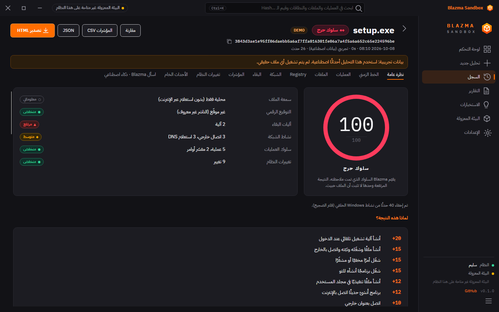
</p>

يحلّل Blazma Sandbox الملفات والملفات المضغوطة وعناوين الويب المشبوهة على Windows. يفحص الملف
دون تشغيله، ثم يشغّله داخل **Windows Sandbox** معزولة تُحذف بعد الاستخدام (أو داخل جهاز افتراضي
VirtualBox أو Hyper-V)، ويراقب ما يفعله، ويربط الأحداث بعضها ببعض، ثم يحوّلها إلى تقرير يستطيع أي
شخص قراءته:

- **ماذا حدث؟** خط زمني، وشجرة عمليات، وسلاسل سلوك.
- **لماذا يهم ذلك؟** شروحات بلغة واضحة ودرجة خطورة قابلة للتفسير.
- **ما الأدلة على ذلك؟** كل نتيجة ترتبط بالأحداث التي بُنيت عليها.

Blazma **ليس برنامج مكافحة فيروسات**. ولا يصف ملفًا بأنه "برمجية خبيثة" بناءً على مؤشر واحد أبدًا.
الدرجة تصف السلوك الذي رُصد؛ *والدرجة المرتفعة لا تثبت وحدها أن الملف خبيث*.

> Blazma Sandbox مخصص للتحليل الدفاعي ولأبحاث الأمان **المصرّح بها**.

## الميزات

| المجال | ما تحصل عليه |
|---|---|
| **التحليل الثابت** | SHA-256/SHA-1، ونوع الملف (بما في ذلك مستندات Office/PDF والملفات المضغوطة)، وترويسات PE، والأقسام والإنتروبيا، والدوال المستوردة والمصدّرة، و**imphash**، ومعلومات الإصدار، والتحقق من Authenticode دون اتصال، والنصوص ذات الدلالة، و**95 قاعدة قدرات** على نمط capa (تسجيل ضغطات المفاتيح، والحقن، ومقاومة التنقيح، والتشفير، والوصول إلى بيانات الاعتماد...)، و**القيم المستخرجة** (عناوين URL، وعناوين IP، والنطاقات، وعناوين البريد الإلكتروني، ومسارات السجل، ومحافظ العملات الرقمية، والرموز المميزة (tokens)، وكتل Base64). يعمل في عملية مساعدة منفصلة ولا ينفّذ الملف أبدًا. |
| **YARA** | ملفات `.yar` الخاصة بك، يفحص بها محرك مُدار مدمج العيّنةَ والملفات التي تنشئها ومناطق الذاكرة المشبوهة. يدعم النصوص والقيم الست عشرية والتعابير النمطية مع المعدِّلات الشائعة، والوحدة `pe` (الأقسام والاستيرادات وimphash ومعلومات الإصدار). لا حاجة إلى مكتبة أصلية. [docs/YARA.md](docs/YARA.md) |
| **الملفات المضغوطة** | تُعرض محتويات ZIP (ZipCrypto وAES) و7z وRAR وTAR وGZip دون تشغيل أي شيء. تُجرَّب كلمات مرور العيّنات المعتادة (`infected` و`malware` و`virus`) تلقائيًا؛ ويُستخرج الملف الذي تختاره في عملية مساعدة. |
| **عناوين الويب** | حلّل عنوان URL: العلامات التجارية المقلَّدة، وpunycode، وخدمات اختصار الروابط، والنطاقات الخطرة، وبيانات الاعتماد المضمّنة، ثم افتحه في Edge داخل البيئة المعزولة (يتطلب الشبكة الحقيقية وموافقتك). |
| **التشغيل المعزول** | **Windows Sandbox** مع إيقاف كل القنوات الاختيارية، أو جهازك الافتراضي الخاص على **VirtualBox** أو **Hyper-V** يُستعاد من لقطة نظيفة قبل كل تشغيل وبعده. [docs/VIRTUAL-MACHINES.md](docs/VIRTUAL-MACHINES.md) |
| **إنترنت محاكى** | الوضع الافتراضي: لا شبكة حقيقية، لكن الأسماء تُحل إلى خادم وهمي داخل البيئة المعزولة يجيب على طلبات HTTP ويسجّل الطلبات وأسماء خوادم TLS والملفات المرفوعة، فتكشف برامج التنزيل واتصالات C2 عمّا كانت تريده. |
| **المراقبة** | وكيل داخل البيئة المعزولة يستخدم ETW: العمليات، والملفات، والسجل (Registry)، وTCP/UDP، وDNS، والمهام المجدولة، إضافة إلى لقطات حالة قبل التشغيل وبعده، و**لقطات شاشة** للبيئة المعزولة، و**الملفات التي أنشأتها العيّنة** (تُنسخ إلى الخارج وتُحلَّل)، و**مناطق الذاكرة** التي تحوي شيفرة محقونة أو مفكوكة الحزم، والتقاط اختياري لحركة الشبكة بصيغة **pcapng**. |
| **الوضع التفاعلي ومحاكاة المستخدم** | شاهد شاشة البيئة المعزولة مباشرة، وأضف دقيقتين أو أنهِ التحليل مبكرًا. يُضغط على أزرار برامج التثبيت تلقائيًا (Next وInstall وFinish؛ ولا يُضغط Cancel أبدًا). |
| **خط زمني موحَّد** | نموذج أحداث واحد لكل شيء، مرتب وقابل للتصفية حسب الفئة والخطورة والعملية والفترة الزمنية والنص. يعرض أكثر من 100 ألف حدث بفضل العرض الافتراضي (virtualization). |
| **الربط** | شجرة عمليات آمنة من إعادة استخدام PID، وكشف "أُسقط ثم نُفّذ"، وسلاسل سلوك مثل *setup.exe ← أنشأ updater.exe ← شغّله ← مدخل بدء تشغيل ← اتصل بنقطة نهاية*. |
| **كشف الاستمرارية** | مفاتيح Run، ومجلد Startup، والمهام المجدولة، والخدمات، وWinlogon، وIFEO، وAppInit، وActive Setup، ولكل منها شرح مفهوم للإنسان مع التفاصيل التقنية. |
| **محرك الخطورة** | 31 قاعدة سياقية مع معرّفات ATT&CK، وعرض **مصفوفة ATT&CK**، وحدود قصوى لكل فئة، وتفصيل "لماذا هذه الدرجة؟"، وقواعد تسلسل تزن التركيبات، وكتم الضجيج الناتج عن نشاط Windows في الخلفية. |
| **السمعة (اختيارية)** | السجل المحلي دائمًا. **VirusTotal** و**MalwareBazaar** فقط إذا فعّلتهما وأدخلت مفتاحًا: **يُرسل SHA-256، ولا يُرسل الملف أبدًا**. تُشفَّر المفاتيح باستخدام Windows DPAPI. |
| **التقارير والمشاركة** | HTML مستقل بذاته (دون نصوص برمجية، ومقيَّد بـ CSP)، و**PDF** للطباعة بالعربية أو الإنجليزية، وJSON مع بصمة سلامة، وCSV للمؤشرات، و**STIX 2.1**، و**MISP**، ومسودات قواعد **Sigma** و**YARA**، وملف ZIP مشفّر (كلمة المرور `infected`) للملفات المُنشأة. تُحجب البيانات الشخصية افتراضيًا. |
| **Ask Blazma** | اطرح أسئلة عن تقرير ("لماذا الدرجة مرتفعة؟"، "ليش أعطيت الملف High Risk؟"). تأتي الإجابات من البيانات وتستشهد بها. ويمكن اختياريًا أن يضيف **نموذج ذكاء اصطناعي محلي** (Ollama أو LM Studio أو llama.cpp) على هذا الحاسوب ملخصًا، مع وسمه بأنه تفسير من الذكاء الاصطناعي. |
| **سطر الأوامر** | `blazma static` و`analyze` و`batch` و`list` و`export` و`envs`، مع رموز خروج تتبع الحكم، للاستخدام في النصوص البرمجية وخطوط المعالجة. [docs/CLI.md](docs/CLI.md) |
| **مقارنة التحليلات** | الإصدار 1.2 مقابل 1.3 من برنامج التثبيت نفسه: العمليات الجديدة، والاتصالات، والنطاقات، والاستمرارية، والملفات المُسقطة، وفرق الدرجة. |
| **التخصيص** | السمات (Dark وMidnight وLight)، ولون التمييز (درجات عائلة Blazma)، والكثافة، وحجم الواجهة، وتقليل الحركة، وبطاقات لوحة المعلومات، وملفات تعريف التحليل (Quick وStandard وDeep وInteractive، أو ملفاتك الخاصة)، وعتبات الحكم، وتفعيل كل قاعدة ووزنها، وحزم القواعد بصيغة JSON، وقواعد YARA، وقائمة مراقبة محلية، وقائمة سماح للضجيج، واختصارات قابلة للتعديل، ومحتوى التقرير، ومدة الاحتفاظ، ومدخل اختياري في قائمة النقر بزر الفأرة الأيمن في Explorer. |
| **ثنائي اللغة** | العربية والإنجليزية بالكامل، مع تخطيط حقيقي من اليمين إلى اليسار. تبقى المصطلحات التقنية (SHA-256 وPID وIP وRegistry) قابلة للتعرّف. |
| **محلي أولًا** | لا قياس عن بُعد (telemetry) ولا رفع للملفات. عمليات البحث عبر الإنترنت والذكاء الاصطناعي معطلة حتى تفعّلها؛ وحتى عندئذٍ لا يغادر الحاسوبَ إلا البصمة أو التقرير بعد حجب البيانات، ولا يغادره الملف أبدًا. |

## لقطات الشاشة

| | |
|---|---|
| 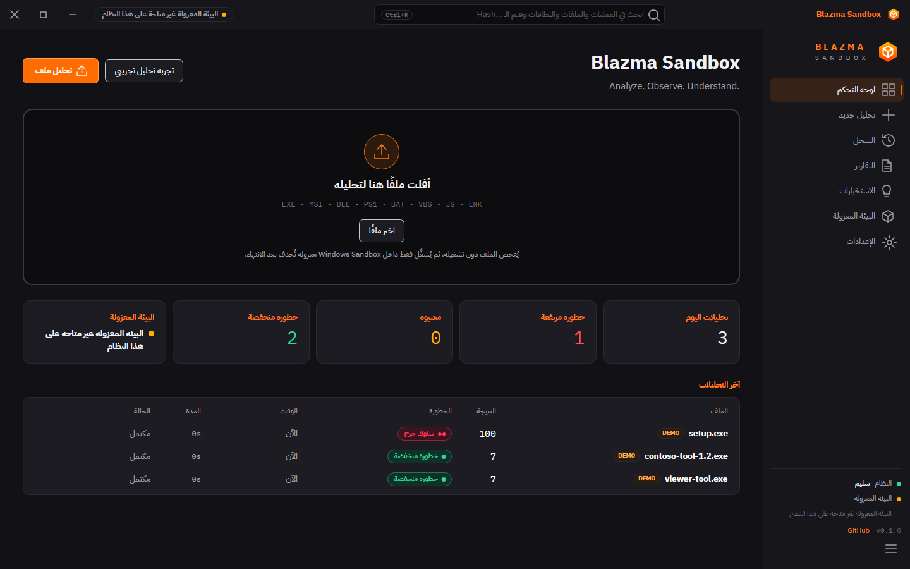 | 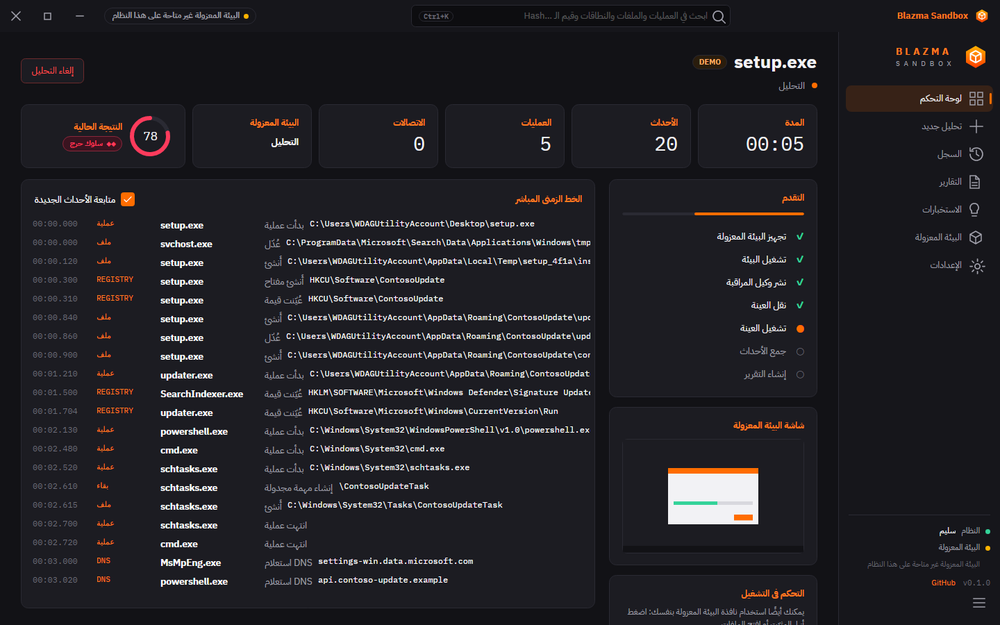 |
| 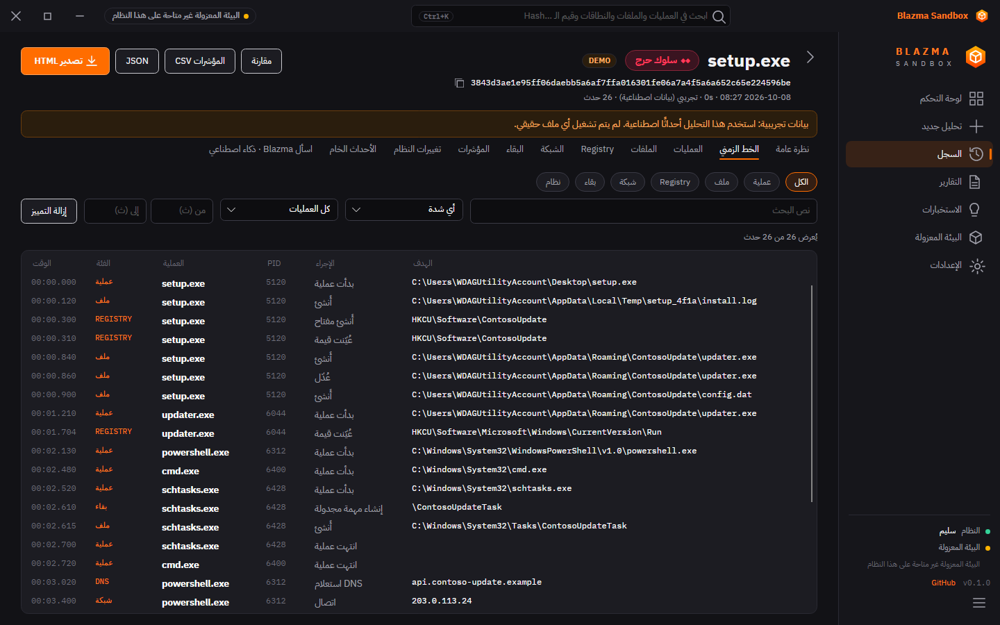 | 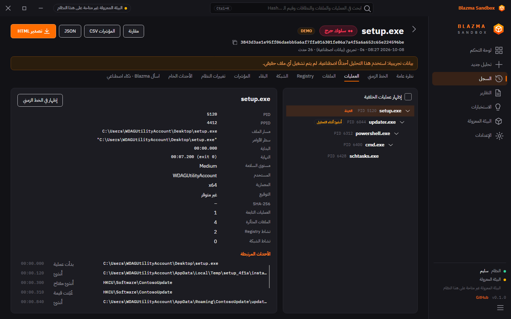 |
| 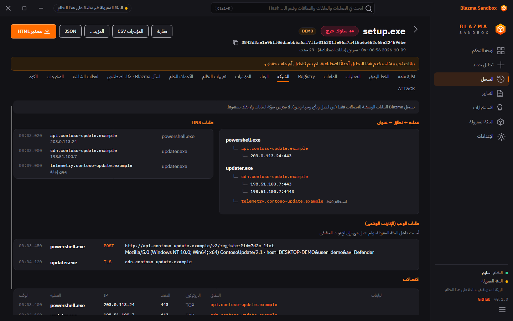 | 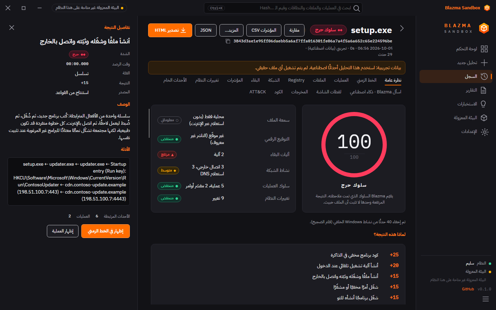 |
| 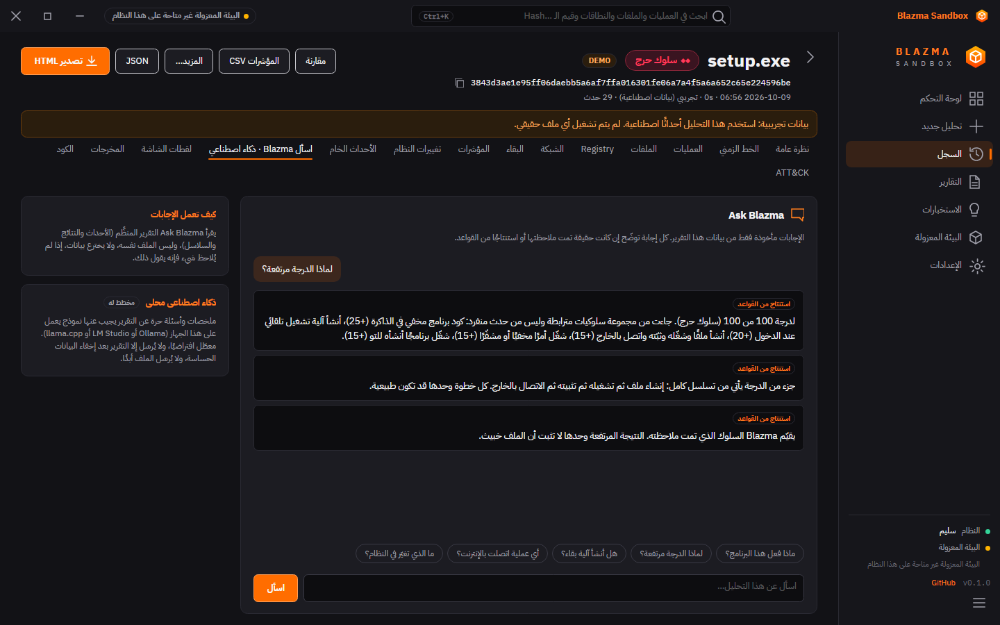 | 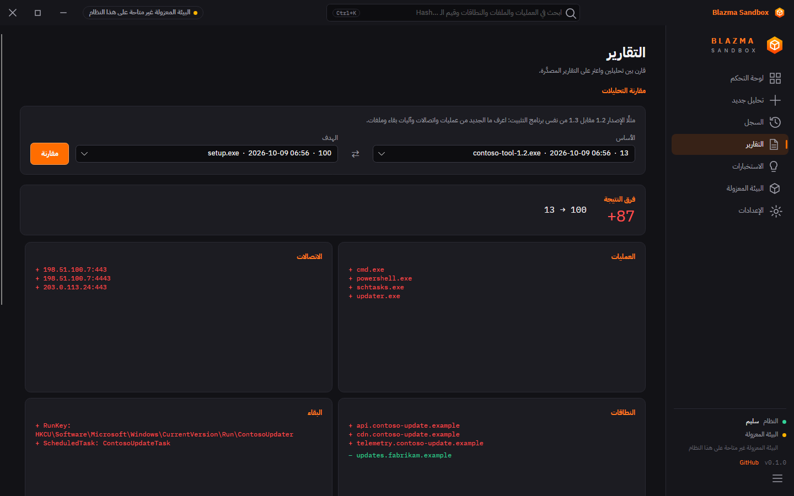 |
| 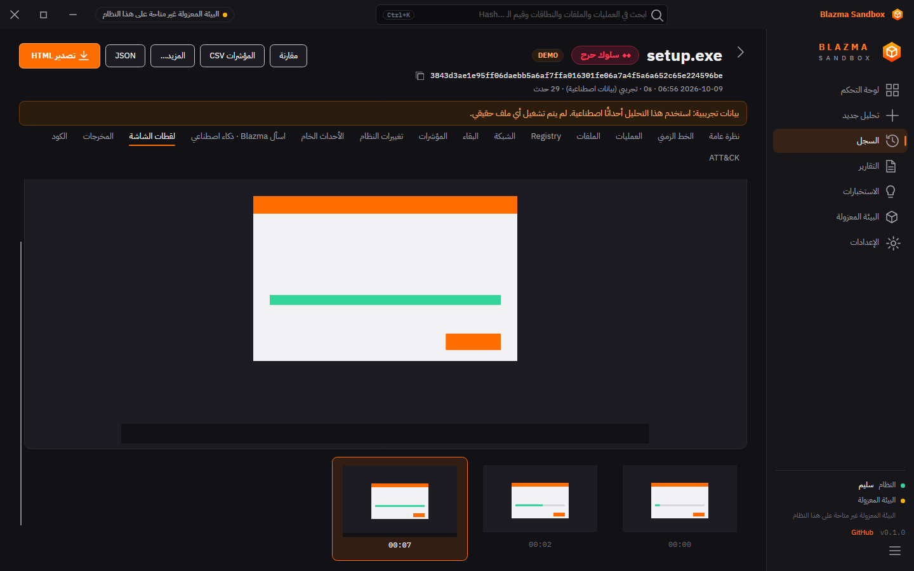 | 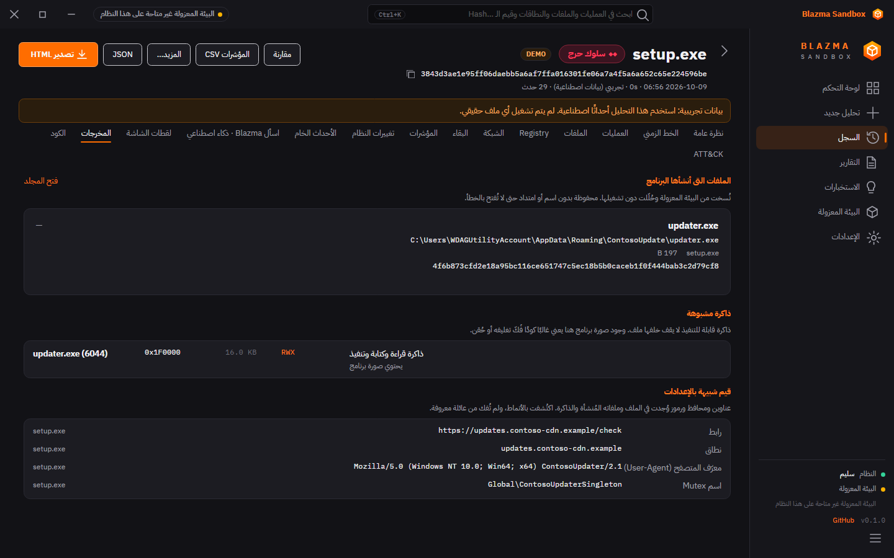 |
| 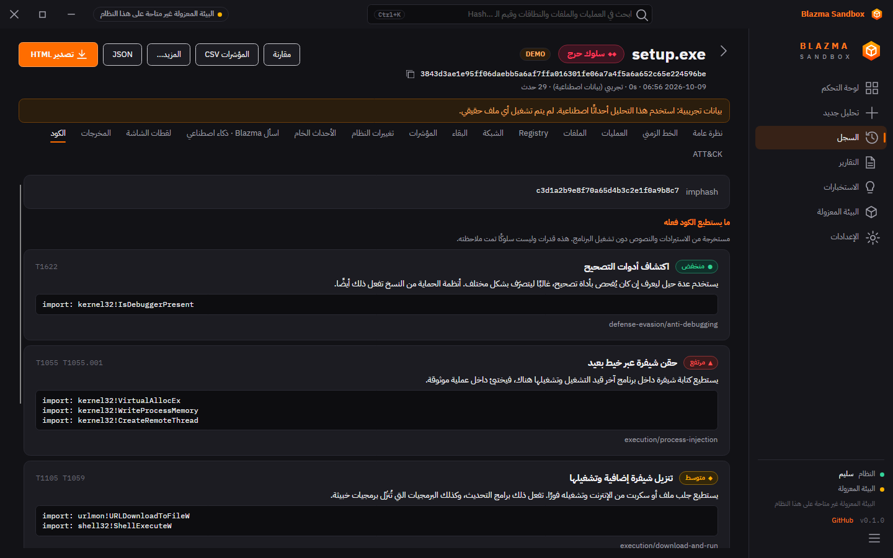 | 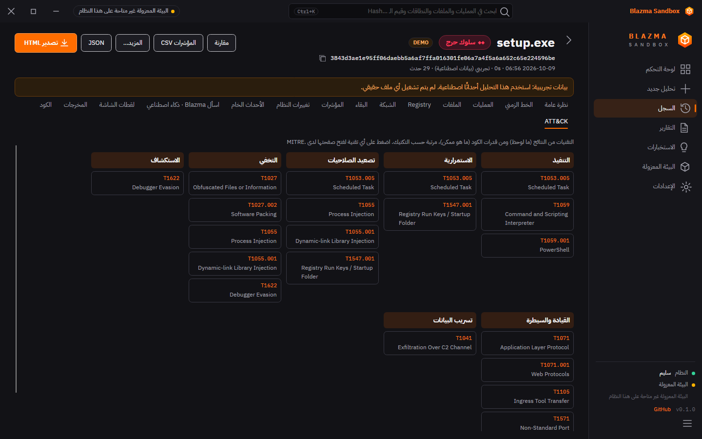 |
| 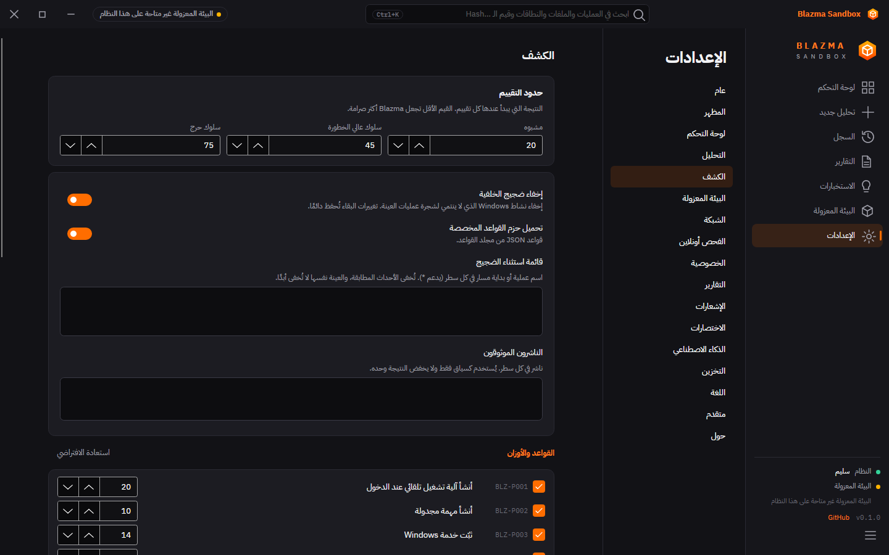 | 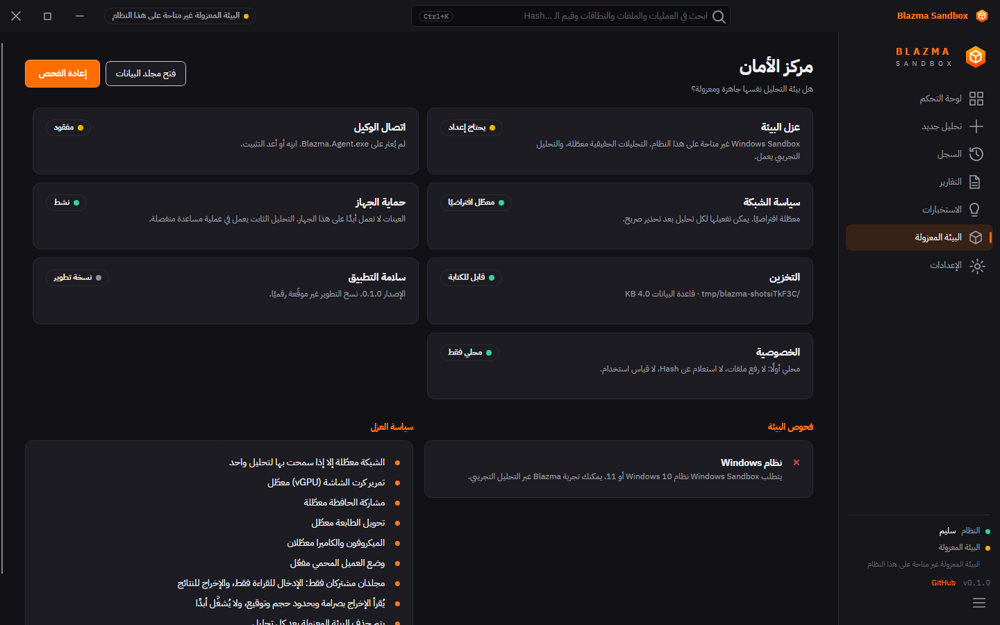 |
| 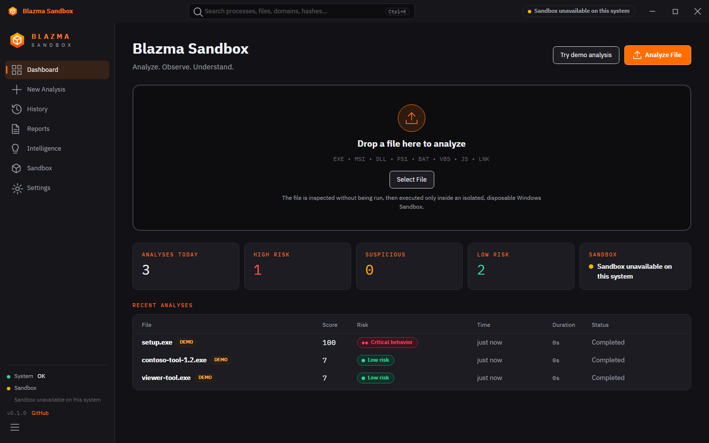 | 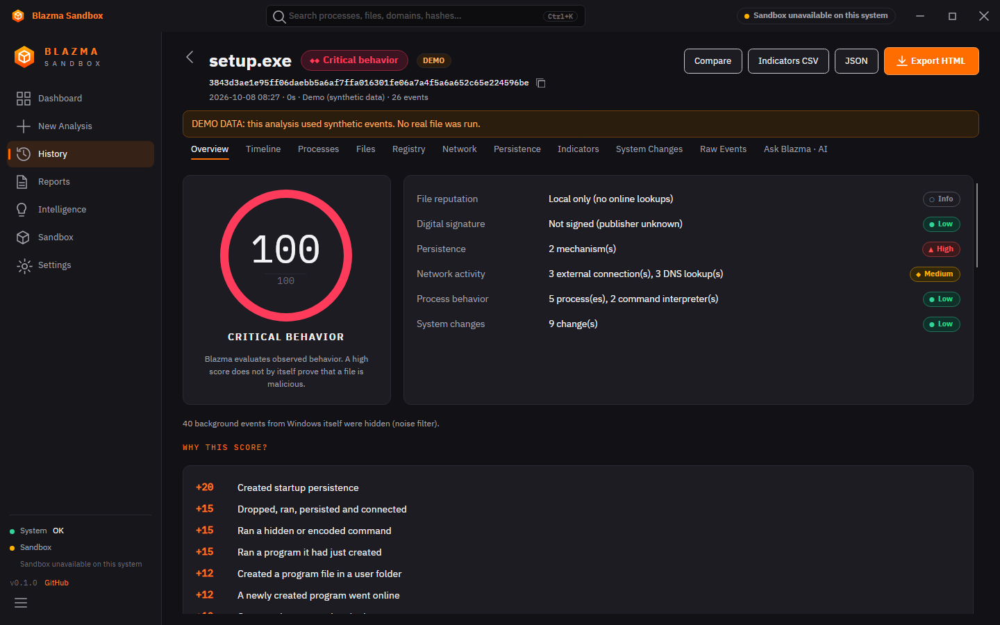 |

تستخدم كل لقطات الشاشة **التحليل التجريبي** المدمج: أحداث اصطناعية، موسومة بوضوح بـ DEMO،
عالجها المحرك الحقيقي. لم تُشغَّل أي عيّنة لإنتاجها.

## البنية

<div dir="ltr">

```
Blazma.App (Avalonia UI) ──► Blazma.Analysis ──► Blazma.Core ◄── Blazma.Storage (SQLite)
        │                       (static, rules,       ▲          Blazma.Reporting (HTML/JSON)
        │                        correlation, risk)    │          Blazma.Intelligence (Ask Blazma)
        └──► Blazma.Sandbox ── Windows Sandbox provider · file channel · demo provider
                  │  ▲
     in/ (read-only)│  │ out/ (writable, untrusted, HMAC-signed)
                  ▼  │
             Blazma.Agent  (runs ONLY inside the sandbox, shares only Blazma.Contracts)
```

</div>

راجع **[docs/ARCHITECTURE.md](docs/ARCHITECTURE.md)** لمعرفة الحدود بين المكوّنات، وآلة حالات
التحليل، ونموذج البيانات، وقرارات التصميم، وراجع **[SECURITY.md](SECURITY.md)** لمعرفة نموذج
الأمان وحدوده.

## التثبيت

1. من صفحة [**الإصدارات (Releases)**](https://github.com/mr-kateba/Blazma-Sandbox/releases) نزّل أحدث `BlazmaSandbox-<الإصدار>-setup.exe`، أو النسخة المحمولة ZIP.
2. شغّل `BlazmaSandbox-<الإصدار>-setup.exe`. يثبّت البرنامج لحسابك فقط ولا يطلب صلاحيات المسؤول، وواجهة التثبيت بالعربية.
3. اختر ما تريد: اختصار على سطح المكتب، وخيار «تحليل باستخدام Blazma Sandbox» في قائمة الزر الأيمن، وإضافة الأمر `blazma` إلى سطر الأوامر.

لأن البرنامج غير موقّع رقميًا بعد، قد يظهر تنبيه Windows SmartScreen: اختر **More info** ثم **Run anyway**.
عند إلغاء التثبيت تبقى تحليلاتك وإعداداتك في `%LocalAppData%\Blazma\Sandbox`؛ احذف هذا المجلد يدويًا إن أردت.

## المتطلبات

- **لتحليل ملفات حقيقية باستخدام Windows Sandbox:** Windows 10 (1903 أو أحدث) أو Windows 11، بإصدار
  **Pro أو Enterprise أو Education**، مع تفعيل المحاكاة الافتراضية (virtualization) في البرنامج الثابت
  (firmware) وتشغيل الميزة الاختيارية *Windows Sandbox* (`optionalfeatures.exe`).
- **على Windows Home** (لا يتوفر Windows Sandbox): استخدم جهازًا افتراضيًا على VirtualBox تجهّزه مرة
  واحدة؛ راجع [docs/VIRTUAL-MACHINES.md](docs/VIRTUAL-MACHINES.md). يتطلب Hyper-V إصدار Pro أو أعلى.
- **للبناء:** .NET 10 SDK. يُبنى على Windows وLinux وmacOS؛ ويعمل التحليل التجريبي وكل الاختبارات
  على جميع هذه الأنظمة.

## البناء من المصدر

<div dir="ltr">

```bash
git clone https://github.com/mr-kateba/Blazma-Sandbox
cd Blazma-Sandbox
dotnet build Blazma.Sandbox.slnx
dotnet test  Blazma.Sandbox.slnx          # 750+ tests, synthetic data only
dotnet run --project src/Blazma.App       # use "Try demo analysis" without Windows Sandbox
```

</div>

الحزمة الخاصة بـ Windows (مستقلة بذاتها، ولا تحتاج إلى تثبيت .NET على الجهاز الهدف):

<div dir="ltr">

```powershell
pwsh scripts/publish.ps1        # → publish/BlazmaSandbox/BlazmaSandbox.exe, blazma.exe (CLI), agent/Blazma.Agent.exe
```

</div>

ينتج `scripts/publish.sh` الحزمة نفسها من Linux أو macOS.

إعادة توليد لقطات الشاشة (دون واجهة رسومية، ولا حاجة إلى شاشة):

<div dir="ltr">

```bash
dotnet run --project tools/Blazma.Screenshots -- docs/screenshots en
dotnet run --project tools/Blazma.Screenshots -- docs/screenshots ar
```

</div>

## نموذج الأمان في فقرة واحدة

لا تعمل العيّنة على حاسوبك أبدًا. يجري التحليل الثابت، وعرض محتويات الملفات المضغوطة، والاستخراج في
عمليات مساعدة قصيرة العمر. ولا يحدث التشغيل إلا في Windows Sandbox (مع تعطيل كل القنوات الاختيارية)
أو في جهاز افتراضي يُستعاد من لقطة نظيفة. يشارك الحاسوب المضيف مجلدين: `in/` للقراءة فقط داخل البيئة
المعزولة؛ و`out/` هو المجلد الوحيد القابل للكتابة، وكل ما فيه يُعامل كمدخلات معادية: أسماء ملفات
محددة بدقة فقط، ولا روابط، وحصص للحجم، وتحليل صارم، وتحقق HMAC، ولا يُنفَّذ أي شيء، ويعيد المضيف
ترميز لقطات الشاشة، وتُخزَّن الملفات المُنشأة بأسماء محايدة. افتراضيًا **لا تملك البيئة المعزولة شبكة
حقيقية**: بل يجيب بدلًا منها إنترنت محاكى داخلها. الشبكة الحقيقية وعمليات البحث عبر الإنترنت والذكاء
الاصطناعي معطلة افتراضيًا وتتطلب موافقة صريحة. التفاصيل والقيود المعروفة: [SECURITY.md](SECURITY.md).

## خارطة الطريق

| المرحلة | الحالة |
|---|---|
| 1. الأساس: هيكل الواجهة، ونظام التصميم، والتعريب، وقاعدة البيانات، والنماذج، والوضع التجريبي | ✅ مكتملة |
| 2. التحليل الثابت: البصمات، وPE، والتواقيع، وimphash، والقدرات، وYARA، والملفات المضغوطة، وعناوين URL | ✅ مكتملة |
| 3. البيئة المعزولة: Windows Sandbox، وVirtualBox، وHyper-V، وقناة وكيل موقّعة | 🧪 مُنفَّذة، وتحتاج إلى تحقق على Windows حقيقي |
| 4. المراقبة: أحداث ETW، ولقطات الشاشة، والملفات المُنشأة، والذاكرة، وpcap، والإنترنت المحاكى، ومحاكاة المستخدم | 🧪 مُنفَّذة، وتحتاج إلى تحقق على Windows حقيقي |
| 5. التحليل: القواعد، والخطورة، والربط، والاستمرارية، ولقطات الحالة، ومصفوفة ATT&CK | ✅ مكتملة |
| 6. التقارير: التقرير، والسجل، والبحث، وHTML، وPDF، وJSON، وSTIX، وMISP، وSigma، وYARA | ✅ مكتملة |
| 7. الاستخبارات: Ask Blazma، وسمعة البصمات الاختيارية، والذكاء الاصطناعي المحلي الاختياري | ✅ مكتملة |
| 8. متقدم: المقارنة ✅ · سطر الأوامر ✅ · استخبارات المجتمع، والإضافات | مخطط لها |

القائمة الكاملة: [docs/ROADMAP.md](docs/ROADMAP.md). تظهر الميزات التي لم تُبنَ بعد في التطبيق بوسم
*مخطط لها* وتكون معطلة؛ ولا شيء يتظاهر بأنه يعمل.

## المساهمة

راجع [CONTRIBUTING.md](CONTRIBUTING.md). يمكن المساهمة بقواعد الكشف دون كتابة شيفرة، على شكل حزم
قواعد بصيغة JSON: [docs/RULE-PACKS.md](docs/RULE-PACKS.md).

## المطوّر

Blazma Sandbox من تطوير **[mr-kateba](https://github.com/mr-kateba)**.

## الترخيص

لم يُختر الترخيص بعد؛ راجع [LICENSE](LICENSE). الخطوط المضمّنة (IBM Plex Sans Arabic وIBM Plex Mono)
مرخّصة بموجب SIL Open Font License ([assets/fonts/OFL.txt](assets/fonts/OFL.txt)).

</div>
